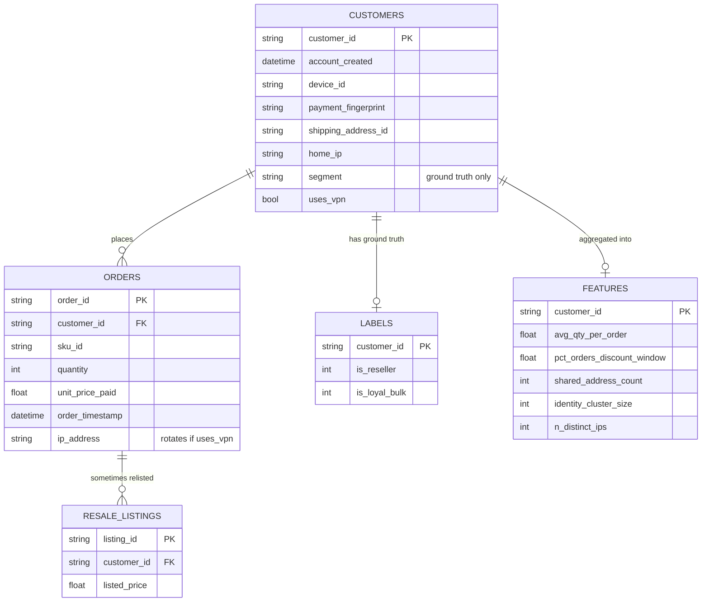
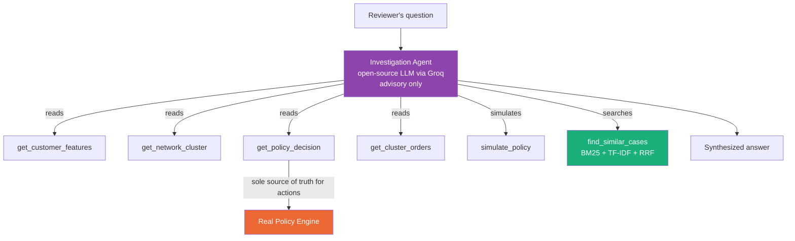
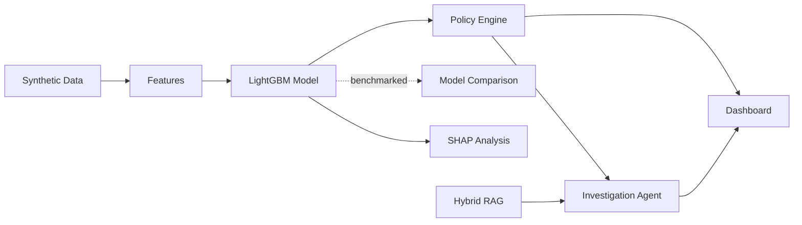

# Resale-Guard

**Checkout-time detection of discount-arbitrage resellers** ~ extending PinchAI's
post-purchase buyer-intent thesis one step earlier, to the moment of purchase.

---

## The Problem

Retailers running time-boxed discount promotions (flash sales, seasonal
clearance) lose margin to buyers who purchase in bulk not for personal
use, but to resell at a markup on secondary platforms. This is invisible
to traditional fraud systems because **no rule is technically broken** —
it's a legitimate purchase, correctly paid, correctly delivered. The harm
is economic (margin erosion, distorted inventory signals, unfair access
for genuine customers), not transactional.

## Why This Problem

PinchAI's thesis connects checkout → return → warehouse signals into one
buyer-intent view — but that lens is currently anchored at *returns*.
This project extends the same lens one step earlier, to checkout,
catching abuse a returns-focused system structurally cannot see, since
the item in question is never returned. Full scoping discussion,
including explicit in/out-of-scope decisions: `docs/00_problem_framing.md`.

## What Success Looks Like

The easy cases (obvious bulk resellers) are table stakes. The real test:

- **Not flagging legitimate bulk/shared-identity customers** — a loyal
  repeat buyer, a household sharing one shipping address
- **Still catching resellers who evade the obvious signals** — spreading
  purchases across non-sale days, splitting volume across coordinated
  accounts, rotating IP addresses via VPN

---

## 0. Data Schema



**Critical:** `RESALE_LISTINGS` feeds only `LABELS`, never `FEATURES` — a
real checkout-time system has no access to future resale-market data.
Enforced in code: `build_features.py` never reads `resale_listings.csv`.

## 1. Data Validation — Proving the Hard Pairs Are Actually Hard

Six customer archetypes, two deliberately close pairs. This isn't
asserted — it's measured, from the actual generated data:


`ring_reseller` vs `shared_address_legit` share near-identical
`identity_cluster_size` — the network signal alone can't separate them.
`stealth_reseller` vs `loyal_bulk` share near-zero discount-window
timing — the most obvious evasion signal alone can't separate them
either. The model has to learn combinations. Full breakdown:
`docs/00_problem_framing.md`.

## 2. Model Performance


340 TN / 3 FP / 3 FN / 120 TP on the test set, AP = 0.998. Every
misclassification was individually inspected against real feature
values, not just counted:

- The 3 false positives are the **most typical** `loyal_bulk`
  customers — not outliers, an honest cost of a genuinely ambiguous
  segment.
- The 3 false negatives are specifically the **smallest, most patient
  stealth-style rings** — a real, specific weak spot, not a random
  miss.

Full error analysis: `docs/01_model_eval.md`.

## 3. Model Comparison


LightGBM wasn't assumed to be the right choice — it was benchmarked
against Logistic Regression and Random Forest on metrics specific to
this project (recall on evasive cases, false-positive rate on legit
customers), not just aggregate accuracy. All three land within a few
points of each other; the real story is which errors each model makes.
Full comparison: `docs/04_model_comparison.md`.

## 4. Explainability — Feature Importance & SHAP


Gain-based importance: purchase-timing and network signals dominate.


SHAP re-ranks some features relative to gain (different question:
average output impact vs. training-split reduction) and reveals a real
interaction effect — `max_qty_single_order` is *not* a monotonic risk
signal, because `loyal_bulk` customers have the second-highest values
of any segment. The model has learned to net this against other
context rather than treat it as a standalone flag. Full writeup,
verified against raw data: `docs/06_shap_analysis.md`.

**Per-customer waterfalls** — exact, additive score explanations:


## 5. Policy Engine — Thresholds vs. Real Scores


Every test-set customer's real score, plotted against the 4 action
zones (ALLOW/FLAG/LIMIT_QTY/BLOCK). Makes error *scale* visible, not
just count — the `ring_reseller` misses sit deep in ALLOW territory
(0.02-0.15), not marginally under a threshold. Full threshold rationale
and a documented override trade-off: `docs/02_policy_engine.md`.

## 6. Investigation Agent

A 6-tool agent (Groq + open-source LLM, free) that can look up customer
signals, cross-reference network clusters, pull combined ring volume,
simulate policy changes, and search past cases via hybrid retrieval
(BM25 + TF-IDF + Reciprocal Rank Fusion). 



**Advisory only** —
`get_policy_decision` always calls the real deterministic engine; the
agent reports what it says, it never invents its own risk assessment.
This guardrail was verified in practice, including a caught-and-fixed
case where the underlying model initially mischaracterized an ALLOW
decision as a "flag." Tool architecture diagram and full design:
`docs/05_architecture.md`.


---
## Results Summary

- **Detection**: 97.6% precision/recall on the test set, with every
  error individually explained, not just tallied
- **Model choice**: benchmarked, not assumed — LightGBM validated
  against 2 alternatives on project-specific metrics
- **Explainability**: SHAP surfaced a genuine non-linear interaction
  effect, verified against raw data before being written up
- **Robustness tested, not just claimed**: VPN IP-rotation alone does
  **not** meaningfully help resellers evade detection (96.6% vs 100%
  caught), because behavioral signals stay exposed regardless of IP
  masking — a real, tested finding, not an assumption
- **The network signal earns its place**: `shared_ip_count` went from
  0% to real feature importance only once a shared-home-network ring
  scenario was actually built into the data — proving the signal
  matters rather than asserting it
- **Advisory-only agent**: 6 tools, hybrid RAG, and a guardrail that
  held up under actual testing, including a caught calibration bug

---

## Architecture



Full diagrams (pipeline, data schema, agent tools): `docs/05_architecture.md`.

## Quickstart

```bash
pip install -r requirements.txt
python3 src/data_gen/generate.py          # generates data/*.csv
python3 src/features/build_features.py    # generates data/features.csv
python3 src/model/train.py                # trains the model
python3 src/policy/engine.py              # demo: sample decisions across segments
streamlit run src/dashboard/app.py        # full interactive dashboard
```

The investigation agent needs a free Groq API key (`GROQ_API_KEY` env
var) — see `src/agent/investigation_agent.py`.

## Documentation Index

| Doc | Contents |
|---|---|
| `docs/00_problem_framing.md` | Problem statement, scope, archetype rationale, empirical hard-pairs proof |
| `docs/01_model_eval.md` | Per-segment eval, visuals, honest error analysis |
| `docs/02_policy_engine.md` | Thresholds, override trade-offs, threshold-zone visual |
| `docs/03_roadmap_and_limitations.md` | What's still out of scope, and why |
| `docs/04_model_comparison.md` | LogReg / RandForest / LightGBM, real trade-off |
| `docs/05_architecture.md` | Pipeline, data schema, agent tool diagrams |
| `docs/06_shap_analysis.md` | SHAP summary, per-customer waterfalls, a genuine interaction-effect finding |
| `docs/checklist.md` | Phase-by-phase build log |

## Repo Structure

```
src/
  data_gen/       synthetic data generation (incl. VPN/ring variants)
  features/       feature engineering (18 signals)
  model/          training, evaluation, comparison, SHAP
  policy/         score-to-action engine + threshold visualization
  dashboard/      Streamlit app + agent chat panel
  agent/          6-tool investigation agent + hybrid case retrieval
docs/             design docs, eval results, architecture, roadmap
data/             generated CSVs (not versioned — regenerate via scripts)
```
