# Resale-Guard

**Stopping people who buy in bulk during sales just to resell at a markup —
caught at checkout, before the item even ships.**

**In short:** a checkout-time model that catches resellers exploiting flash
sales — including the ones who spread purchases over weeks, split volume
across fake accounts, or hide behind a VPN — while correctly leaving genuine
bulk buyers alone. Every decision comes with a plain-English reason, not just
a score. On top of it, an AI investigation agent lets a reviewer just *ask* —
"is this part of a bigger ring?" — and get a real, evidence-backed answer,
checked against live data, not a guess.

---

## The Problem, Simply

Retailers run flash sales. Some people buy 20 pairs of the same
discounted shoe — not to wear, but to resell on E-commerce at double
the price. Nothing about the purchase is technically against the rules,
so normal fraud systems miss it completely. The cost: lost margin,
fake "sold out" signals, and real customers losing out on stock.

**The hard part isn't catching the obvious cases** (someone buying 20 of
one item is easy to spot). The hard part is:
- **Not punishing innocent people** who happen to buy a lot, or share an
  address with a roommate
- **Still catching resellers who are careful** — spreading purchases
  over weeks, splitting orders across fake accounts, hiding behind a VPN

Everything below is built and tested against exactly those two
challenges, not just the easy case.

---

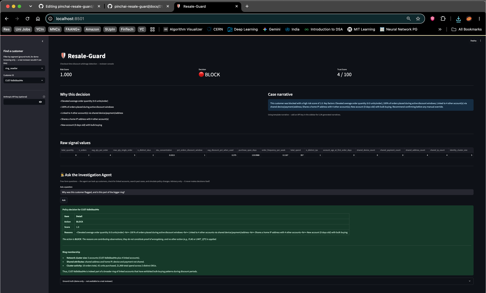

*The reviewer console — a real customer's risk score, decision, and reasons, at a glance.*

## 1. Does the Data Actually Make This Hard?

Before training anything, the six types of customers in this project
were checked to make sure two pairs really do look alike on the
surface — otherwise the "hard part" above wouldn't mean anything.

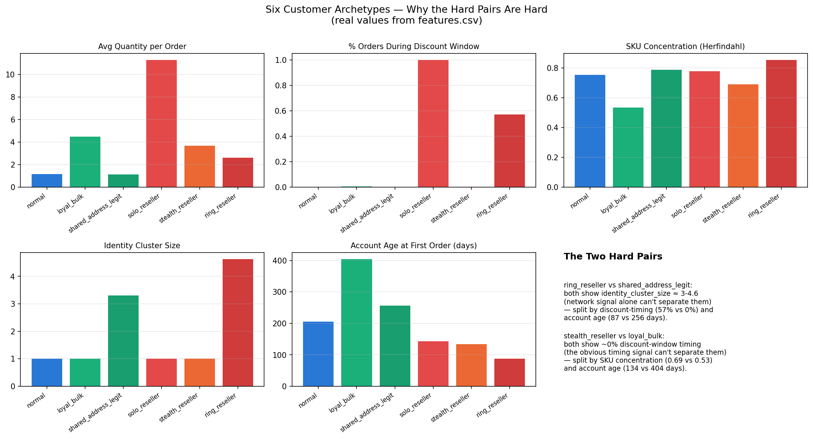

**What to notice:** `ring_reseller` (a coordinated group of fake
accounts) and `shared_address_legit` (an innocent household) score
almost the same on "how many accounts share this address" — you
genuinely can't tell them apart with that signal alone. Same story for
`stealth_reseller` vs. `loyal_bulk`: both look totally normal in terms
of *when* they buy. Real detection needs more than one signal.
*(Deeper dive: `docs/00_problem_framing.md`)*

## 2. How Well Does the Model Actually Perform?

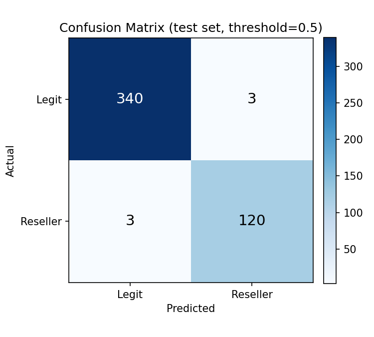

**What to notice:** out of 466 test customers, the model got 460 right
and only 6 wrong. That's a 97.6% success rate.

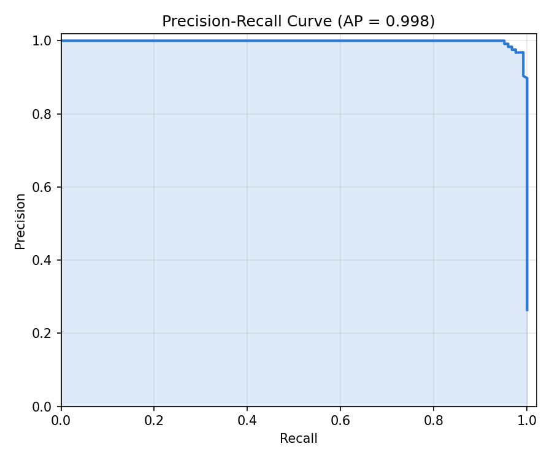

**What to notice:** this curve stays near the top-right corner, which
means the model rarely has to trade "catching more resellers" against
"wrongly flagging innocent people" — it's not forced to pick one over
the other.

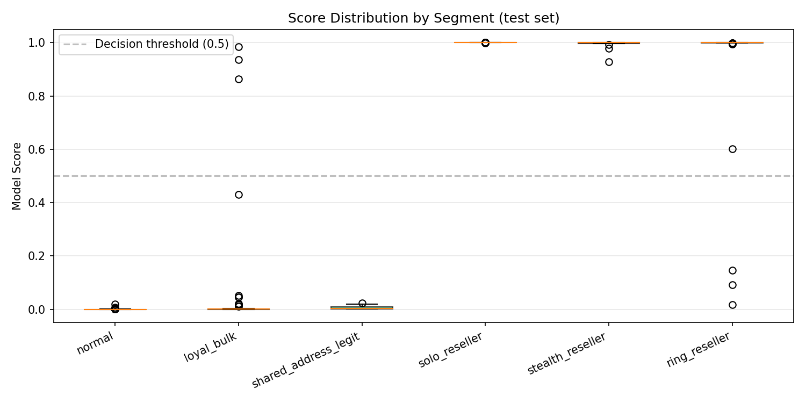

**What to notice:** each dot is one real customer. Legit customers
(bottom 3 rows) cluster near 0 (safe), resellers (top 3 rows) cluster
near 1 (risky) — with only a handful of dots landing in the wrong spot.
Those 6 mistakes were looked at individually, not just counted: the
wrongly-flagged customers turned out to be totally typical legit
buyers (an honest, acceptable trade-off), and the missed resellers were
specifically the smallest, most careful coordinated groups — a real,
useful thing to know. *(Full breakdown: `docs/01_model_eval.md`)*

## 3. Is LightGBM Actually the Right Model, or Just the First One Tried?

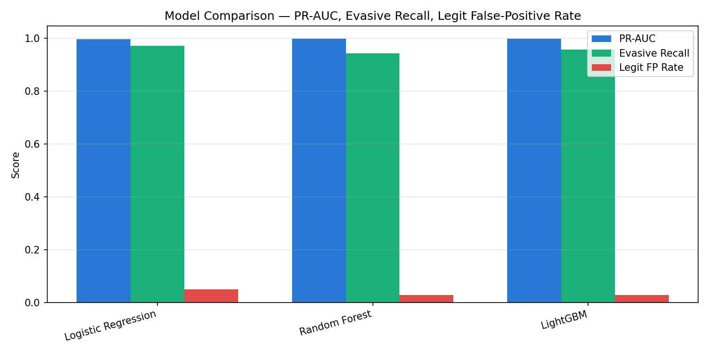

**What to notice:** three different types of models were tested side by
side — a simple one, a mid-complexity one, and the one actually used
(LightGBM). All three land close together, which is itself informative:
it means the *signals* being fed into the model matter more than which
algorithm processes them. LightGBM was kept because it balances catching
resellers and not annoying innocent customers slightly better than the
alternatives. *(Full comparison: `docs/04_model_comparison.md`)*

## 4. Why Did the Model Flag *This* Customer?

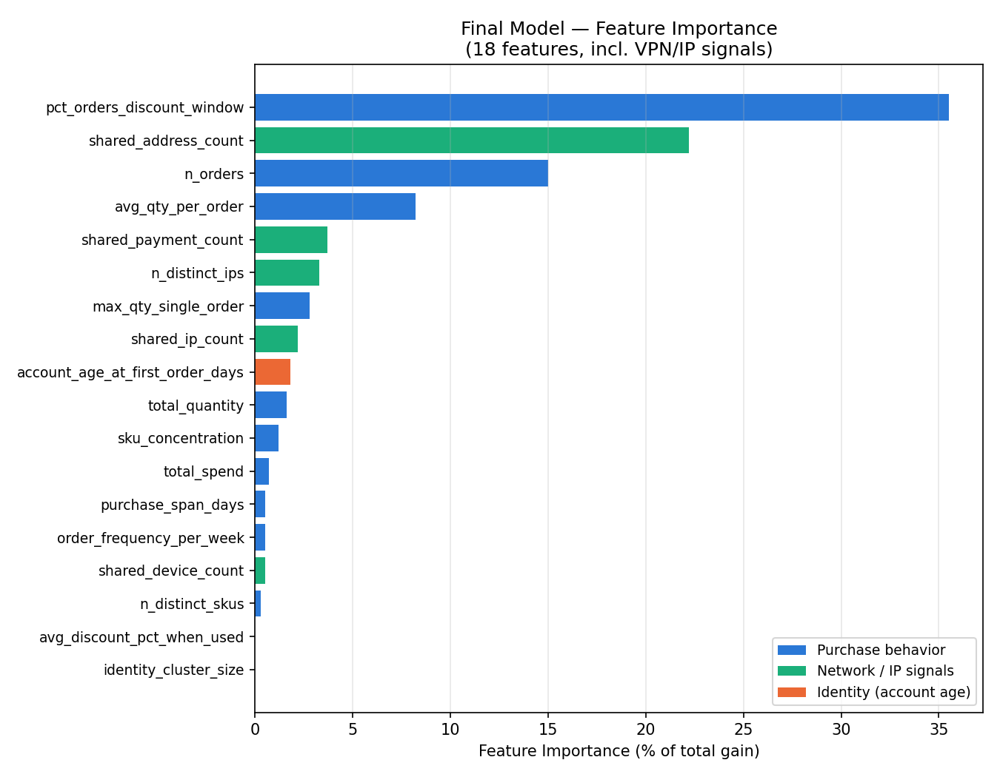

**What to notice:** the top bar is what mattered most overall — buying
heavily during a sale window. Green bars are network-based signals
(shared addresses, IPs) — genuinely useful, not just decoration.

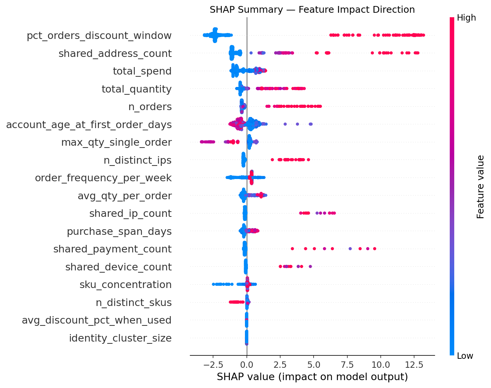

**What to notice:** red dots = a high value for that signal, blue =
low. Red dots pushed right = that signal made the model *more*
suspicious; red pushed left = *less* suspicious. One surprise found
here: a single very large order doesn't always mean "reseller" — some
totally legit bulk buyers also place occasional big orders, and the
model correctly learned not to punish that on its own.
*(Full writeup: `docs/06_shap_analysis.md`)*

**Three real examples, explained one purchase at a time:**

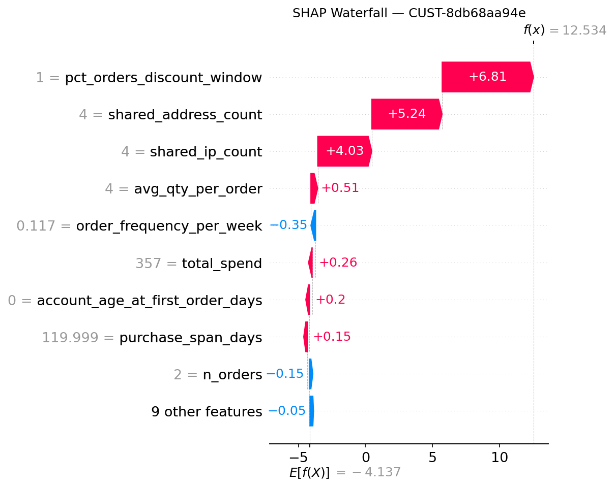
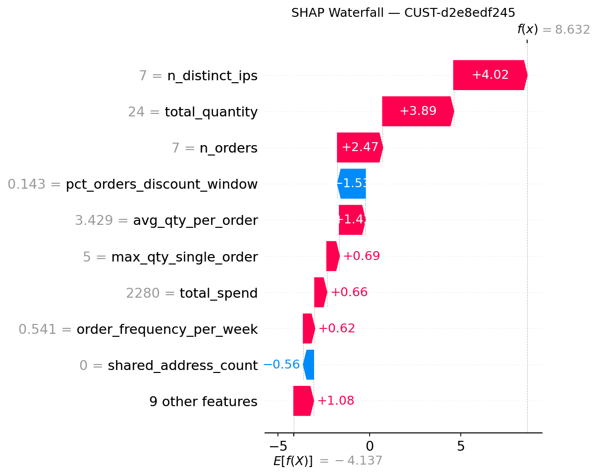
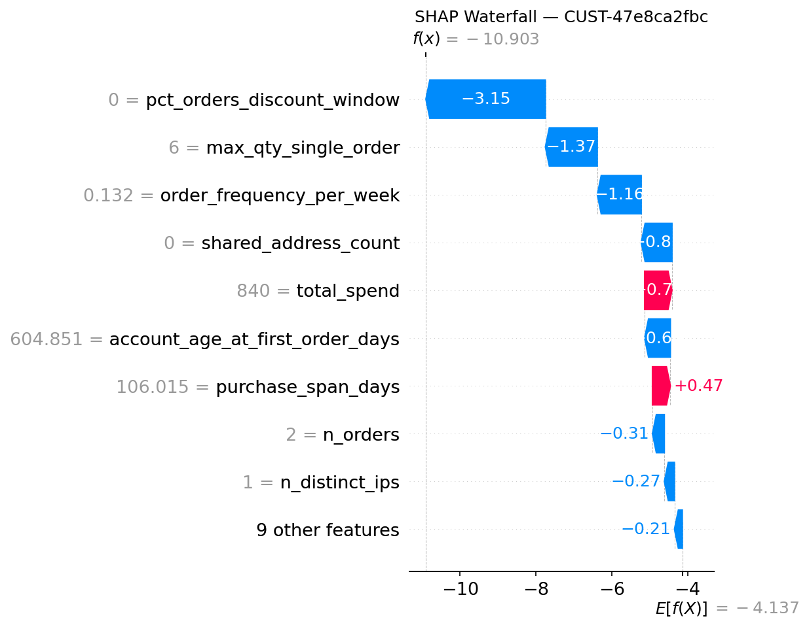

**What to notice:** each chart shows exactly which signals pushed one
specific customer's score up or down — this is what a fraud reviewer
would actually want to see, not just a single risk number.

## 5. How Does a Score Turn Into an Actual Decision?

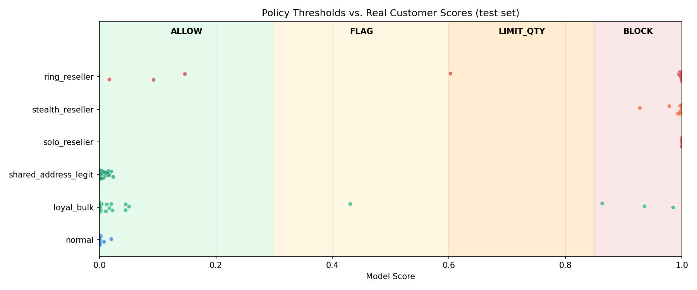

**What to notice:** scores below 0.3 get allowed, above 0.85 get
blocked, with two in-between zones for softer responses. Every real
test customer is plotted here — you can see the misses from Section 2
sitting close to 0 instead of near a boundary, meaning they weren't
"almost caught," they were genuinely tricky. *(Full policy logic:
`docs/02_policy_engine.md`)*

## 6. An AI Assistant a Fraud Reviewer Can Actually Talk To

Instead of just showing a score, this project includes a chat-style
assistant a reviewer can ask questions like *"is this part of a bigger
ring?"* — and it goes and checks, using real tools, not guesswork.

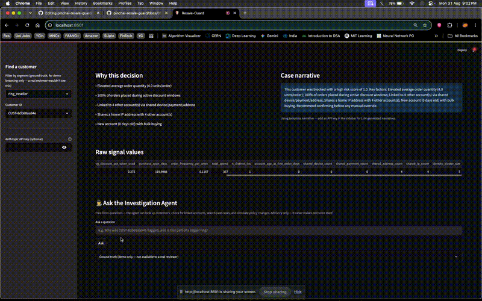

*A quick walkthrough: selecting a customer, seeing the risk decision, and asking the investigation agent whether it's part of a bigger ring.*


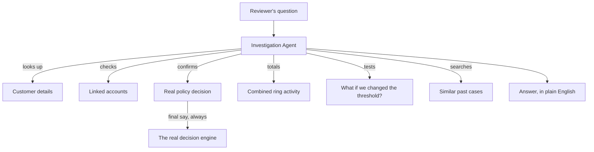

**What to notice:** the assistant can look things up and explain them,
but it never gets to make the actual call — the box labeled "the real
decision engine" always has final say. This was tested for real: an
early version of the assistant once described a safe customer as
"flagged" when they weren't, and that mistake was caught and fixed.
*(Full design: `docs/05_architecture.md`)*

## 7. Where Does the Underlying Data Live?

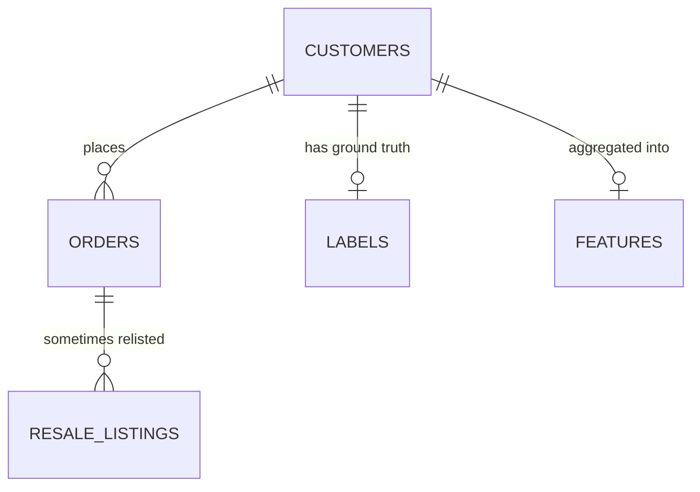

**What to notice:** `RESALE_LISTINGS` (where items get relisted for
resale) only ever feeds into `LABELS` — it's never allowed to touch
`FEATURES`, the actual signals the model learns from. That's on
purpose: a real checkout system would never know in advance whether an
item gets resold later, so the model isn't allowed to "cheat" with
future information either. *(Full schema: `docs/05_architecture.md`)*

---

## Results, in Plain Terms

- **97.6% correct** on customers it had never seen, with every mistake
  individually explained rather than just counted
- **The model choice was tested, not assumed** — LightGBM beat two
  alternatives, but only by a little, which is itself an honest finding
- **A real surprise was found and verified**: a single big order isn't
  automatically suspicious — it depends on the customer's broader
  pattern
- **VPN use alone doesn't help resellers hide** — tested directly:
  VPN-using resellers were still caught at almost the same rate
  (96.6%) as non-VPN ones, because other signals stay visible either way
- **The network signal (shared IPs/addresses) had to earn its place** —
  it showed zero value until a realistic "shared household" scenario
  was actually built to test it, then it worked
- **The AI assistant's guardrail was tested, not just designed** — a
  real mistake was caught and fixed, not just assumed away

---

## Try It Yourself

```bash
pip install -r requirements.txt
python3 src/data_gen/generate.py          # builds the fake customer data
python3 src/features/build_features.py    # turns it into model-ready signals
python3 src/model/train.py                # trains the model
python3 src/policy/engine.py              # see sample decisions
streamlit run src/dashboard/app.py        # the full interactive dashboard
```

The chat assistant needs a free Groq API key (`GROQ_API_KEY`) — see
`src/agent/investigation_agent.py`.

## Read More

| Doc | What's in it |
|---|---|
| `docs/00_problem_framing.md` | The full problem statement and what's in/out of scope |
| `docs/01_model_eval.md` | Detailed results and error analysis |
| `docs/02_policy_engine.md` | How scores become decisions |
| `docs/03_roadmap_and_limitations.md` | What's intentionally left undone, and why |
| `docs/04_model_comparison.md` | The model comparison in full |
| `docs/05_architecture.md` | Full diagrams |
| `docs/06_shap_analysis.md` | The full explainability writeup |
| `docs/checklist.md` | The build log, phase by phase |

## Repo Layout

```
src/
  data_gen/       fake customer/order data generation
  features/       turns raw data into model-ready signals
  model/          training, evaluation, comparison, SHAP
  policy/         turns a score into a decision
  dashboard/      the interactive app
  agent/          the chat assistant + its search tools
docs/             write-ups, diagrams, results
data/             generated data files (not stored in git — regenerate with the scripts above)
```

## Caveats and Way Forward

Being upfront about what this project doesn't cover yet, rather than
letting the results speak for more than they actually prove.

**What's genuinely tested vs. what's assumed:**
- Everything above ran on **synthetic data** (~2,400 customers). The
  patterns were designed to be realistic and deliberately hard to
  separate, but no amount of careful design replaces real transaction
  data. Treat the specific numbers (97.6%, AP=0.998) as a proof of
  approach, not a production guarantee.
- VPN evasion was tested for real — but only one evasion tactic. A
  determined adversary combining several evasion techniques at once
  (VPN *and* address rotation *and* purposely-random timing) hasn't
  been tried.
- The known weak spot found in testing — **small, patient reseller
  rings** (3-4 coordinated accounts, spread-out timing) — is a real gap,
  not a hypothetical one. A production system would need either a
  lower threshold for any nonzero shared-identity signal, or a separate
  review tier for small clusters.

  **Model choice wasn't exhaustively tested.** XGBoost was part of the
  original plan but couldn't be installed on this machine due to an
  environment conflict, so the comparison covers 3 models, not 4. None
  of the 3 had real hyperparameter tuning — the comparison shows
  architecture differences, not each model's best possible performance.
  Results also come from a single train/test split, not cross-validation,
  so the exact numbers could shift somewhat on a different split. And
  the 3 models landed close enough together that "LightGBM wins" is
  somewhat sensitive to which metric matters most to you.

**Scale and infrastructure not addressed:**
- No real-time/latency testing — this runs as a batch script, not a
  live checkout-time API with a response-time budget.
- No cross-retailer identity resolution — a real deployment serving
  multiple retailers would need a privacy-preserving way to share risk
  signals without sharing raw customer data.
- No drift monitoring or retraining pipeline — the model was trained
  once. Real reseller tactics would shift over time, and a production
  system needs a way to notice that and retrain.

**Two deliberate technical trade-offs, made under real constraints:**
- The investigation agent's retrieval uses TF-IDF, not neural
  embeddings — a dependency conflict with the local environment forced
  this choice partway through. TF-IDF is a real, working retrieval
  method, just less semantically flexible than embeddings would be
  (it won't catch synonyms the way embeddings can).
- The agent runs on a smaller, free, open-source model (20B parameters
  via Groq) rather than a larger commercial one. This mostly worked
  well, but one real calibration issue was caught and fixed during
  testing — a reminder that smaller models need their instructions
  spelled out more explicitly, and their answers need to be spot-checked
  against ground truth, not just trusted because they read fluently.

**If this were to continue:**
1. Replace synthetic data with a real (anonymized) transaction sample,
   even a small one, to see how much of this actually holds up
2. Build the specific fix for the small-ring weak spot found in testing
3. Add a proper backtesting/A-B framework instead of a single train/test split
4. Try upgrading the agent's retrieval to real embeddings once a clean
   environment is available
5. Add write-capable agent actions behind a human-approval step, rather
   than staying strictly read-only

## A Note on This Project

This is a self-directed project, not an official assignment — built to
explore a problem discussed in an interview, and to show how I approach
an open-ended ML problem end to end, including going back and
stress-testing my own earlier results instead of treating a first pass
as final.
