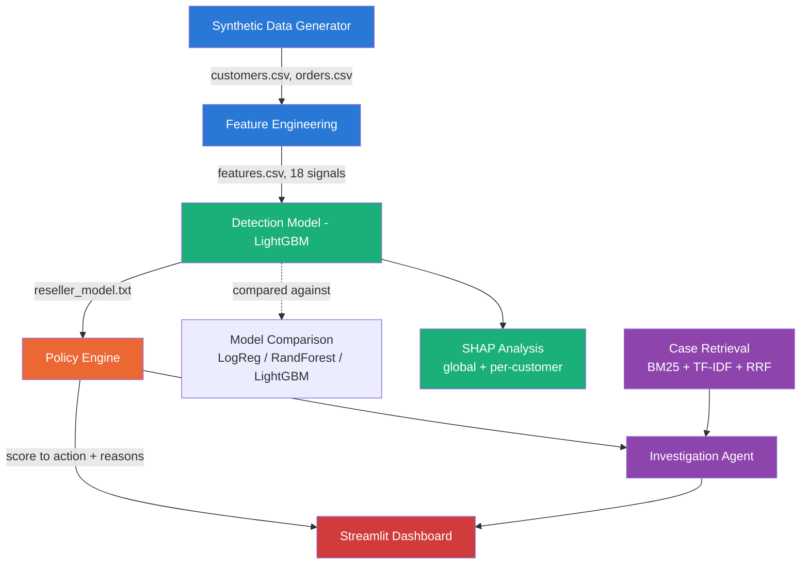
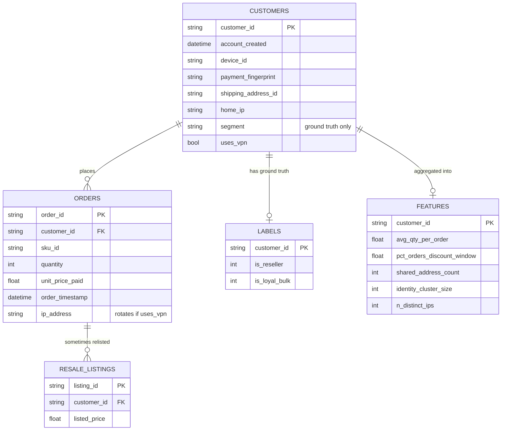
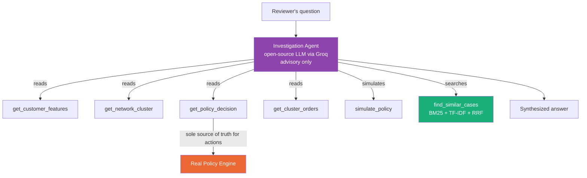

# Architecture

Visual reference for the full system — pipeline, data schema, and agent
tool architecture. GitHub renders the diagrams below natively.

## 1. End-to-End Pipeline

## 2. Data Schema

**Critical:** `RESALE_LISTINGS` feeds only `LABELS`, never `FEATURES` — a
real checkout-time system has no access to future resale-market data.
Enforced in code: `build_features.py` never reads `resale_listings.csv`.

## 3. Investigation Agent — Tool Architecture

**Guardrail:** the agent can read, cross-reference, and simulate — it
never executes a real ALLOW/FLAG/LIMIT_QTY/BLOCK decision.
`get_policy_decision` always calls the real deterministic engine; the
agent reports what it says, never invents its own risk assessment. This
was verified in practice — see the system-prompt fix in
`investigation_agent.py` that corrected a case where the agent initially
mischaracterized an ALLOW decision as a "flag."